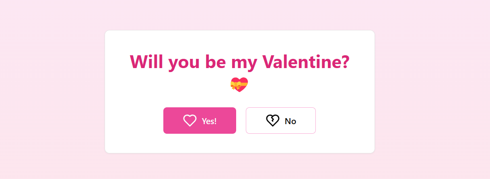

# Will You Be My Valentine? 💖



## 🌟 Description
`Will You Be My Valentine?` is a charming application designed to help you ask someone out on a date in a creative and memorable way.

## ✨ Features
- 🛠️ Easy to use interface
- 🎨 Beautiful UI
- 💌 Customizable message at the end
- 📨 Email response

## 📦 Installation
To install the application, clone the repository and install the dependencies:
```bash
git clone https://github.com/anthonyyoussef01/ValentinesDateAsk.git
cd ValentinesDateAsk
npm install
```

## 🚀 Usage
To start the application, run:
```bash
npm start
```
Follow the on-screen instructions to create your personalized date invitation.

## 📄 License
This project is licensed under the MIT License.